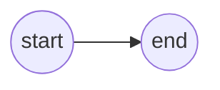

# Asset system design

## Main design ideas

Should be able to load :

1. image and mesh assets
2. unique assets
3. assets composed of many assets
4. embedded resources (image in a gltf)

## How to

idk

